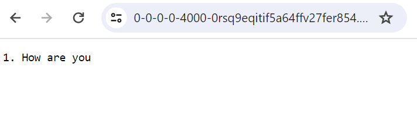
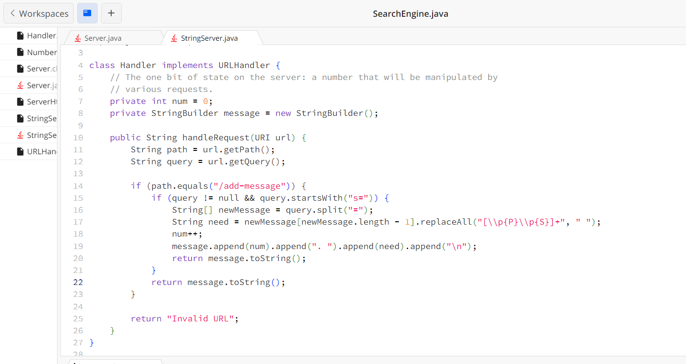
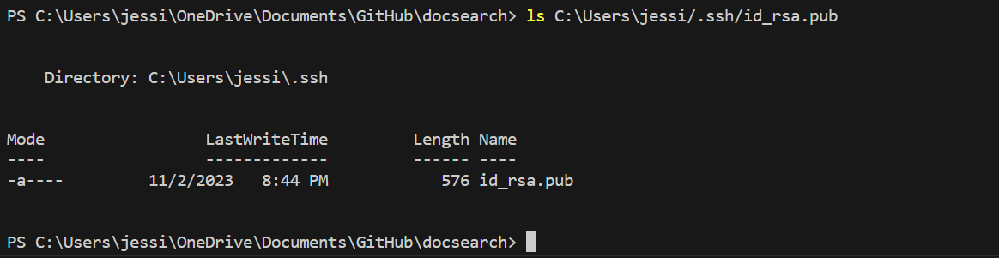
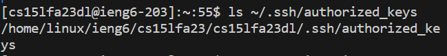
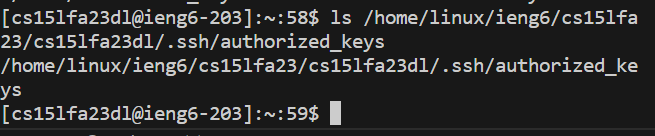
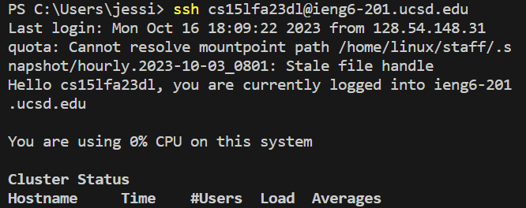

Part 1

After I code, I use the link with query '/add-message?s=How are you' to test my code. At first it did not shows right which have a + between each word instead of space, so the only way I do is to move all the marks of the text we need to make it looks right. Since there will become a % connect between each word in the link we enter, it is kind of hard to remove it. But after I fix it, the message we enter in query appear in the page correctly. 

Another methods I use is add one more text,'/add-message?s=Hello World' and than use'/add-message' as the path, without adding any query, it also works and shows all the messages I enter. when we change to another message, the original mesaye will stay and the new message is add below the old one. However, if there is no query after /add-message, it did not add anything to the original text, but shows all the things we already add. After we add the new messages, the frout number 1 will add to 2 and it will appear in front of the second message. 

I use to split out the query part with "=", so I can get the string that need to put. I also add a number as a count number to count for the number we have as the index of the name. 

if there add more values, the num(int) that check the number will increase by one as the index of that new words. Also I change all marks to spaces to debug the error of having + to connect each word instead of space. 

Part 2
The path to the private key for my SSH key for logging into ieng6: 

The path to the public key for my SSH key for logging into ieng6:

A terminal interaction where I log into ieng6 with my course-specific account without being asked for a password.

Part 3

I learn a lot during week 2 and week 3. The most of the things are new to me. That is my first time to learn ssh and connect to course specific account. Also open java and javac in terminal in order to compile and run the java file in the servers. That is also my first time to get touch with servers. It is a little hard for me when I take the skill demo 1, but I will get more practise next time to make everything easier. Thank you for the helps of all Tutors and TAs!
